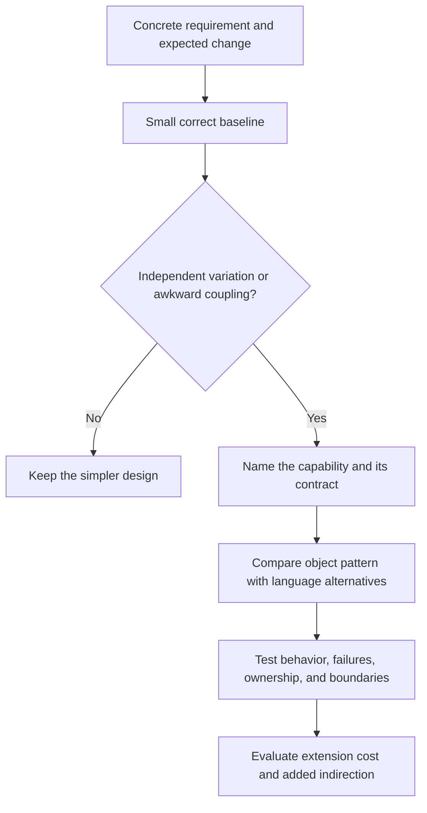

# Pattern Thinking: From Change Pressure to Object Collaboration

## The Starting Point Is a Requirement

“Use Strategy” is not a business requirement. “Add a partner discount without editing every pricing
caller” is a change pressure that can motivate Strategy. Pattern vocabulary helps communicate a design
after the problem is understood; it should not substitute for understanding the problem.

Every lesson keeps a correct baseline. This makes behavior preservation measurable and lets the reader
compare the cost of new indirection against an actual extension. A small stable switch is often clearer
than a family of objects. Complexity that is not paying for a real variation point should be removed.

## Three Levels That Must Not Be Confused

| Level | Typical question | Example |
|---|---|---|
| Architecture | who owns behavior/data, and which dependencies/deployments are allowed? | modular monolith; inward application dependencies |
| Application/distributed pattern | how do workflows coordinate persistence, reads, and failures? | Repository, CQRS, Outbox/Inbox |
| Object-design pattern | how do objects construct, delegate, wrap, or collaborate? | Factory Method, Strategy, Adapter |

The levels interact, but their catalogs are not interchangeable. A CQRS command DTO is not automatically
the complete GoF Command pattern, and an event bus is not interchangeable with an in-process Observer.

## Read Intent, Not Just Shape

Several patterns use interfaces and delegation. That structural similarity does not make them identical.
Strategy substitutes an algorithm. Adapter translates an incompatible contract. Decorator adds behavior
around a compatible capability. Proxy controls access to that capability. Ask why the collaboration
exists before naming it.

Likewise, a method called `Create` is not necessarily GoF Factory Method. A static factory is useful,
but the canonical creator/subclass extension mechanism needs its own explanation and comparison.
Pattern names should improve precision, not relabel every ordinary method as a sophisticated design.

## A Practical Decision Sequence

This is a reasoning aid, not an algorithm that proves a design is correct. The important step is making
the expected change and contract visible enough to challenge in review.

## Contracts Include More Than Method Signatures

For pricing, a method returning `decimal` still needs a contract: whether it is a total or discount,
its valid range, rounding owner, currency assumption, and whether evaluating it has side effects.
For a provider adapter, the contract includes units, error translation, cancellation, and ownership of
the underlying connection/client.

A pattern that preserves type signatures but violates these semantics is not substitutable. Tests
should exercise the shared contract, edge conditions, and failure cases instead of only checking which
concrete class was constructed.

## Lifecycle and Concurrency Questions

- Who creates and disposes a collaborator?
- Is the object request-scoped, reusable, or globally shared?
- Can the strategy/policy change while another caller is using it?
- Does a delegate close over mutable state?
- Can a publisher retain subscribers beyond their intended lifetime?
- Does a wrapper own its inner disposable object or merely borrow it?

The answer is not provided automatically by DI or an interface. Container-safe resolution does not
make stateful instances thread-safe. A pattern example should state lifecycle assumptions rather than
letting a convenient demo imply global singleton safety.

## How Much Abstraction Is Enough?

Prefer a domain-named interface when collaborators have meaningful policies, configuration, dependencies,
or a contract worth discovering in an IDE. Prefer a delegate for a small single-operation algorithm
when a named object adds little. Prefer direct code when variation does not exist.

Do not introduce a generic base entity, universal result hierarchy, reflection registry, mediator,
or `Common` project into every lesson. Repetition of a tiny scenario type can be more educational than
coupling unrelated lessons to a growing teaching framework.

## Modern C# Is a Comparison, Not a Rewrite of History

Records, delegates, pattern matching, iterators, and immutable collections can express parts of a
collaboration compactly. Show where they replace ceremony and where they do not replace the design
intent. For example, a delegate can express a one-method Strategy, while a switch expression does not
by itself explain a State object's transition policy.

Avoid artificial async methods for pure in-memory computations. Where I/O exists, cancellation and
uncertain partial effects must be explicit. Do not hide exceptions merely to make all demo output look
successful.

## Exercise and Review Protocol

For any proposed pattern, write down the following before implementing it:

1. Original requirement and one concrete likely change.
2. Baseline behavior that must remain unchanged.
3. Collaboration roles, using scenario names rather than `ConcreteThingA`.
4. Simpler alternatives and why one is insufficient here.
5. A boundary/failure case that would expose a wrong implementation.
6. The new indirection/lifecycle cost and a condition for removing it.

If you cannot answer these, adding more interfaces will not make the design clearer.

## Primary References

- [GoF catalog and intent](https://www.informit.com/store/design-patterns-elements-of-reusable-object-oriented-9780321770462).
- [.NET DI guidelines](https://learn.microsoft.com/en-us/dotnet/core/extensions/dependency-injection/guidelines).
- [C# delegates](https://learn.microsoft.com/en-us/dotnet/csharp/programming-guide/delegates/).

## Navigation

- Previous: [Guided roadmap](00-roadmap.md).
- Next: [Strategy](behavioral/strategy.md).
