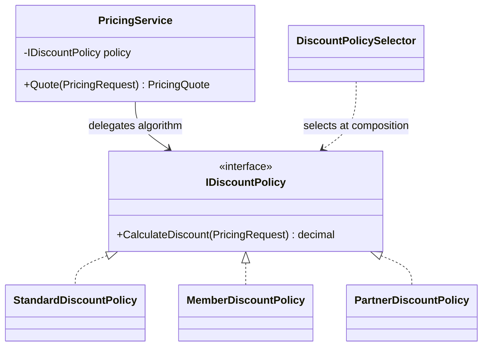

# Strategy: Interchangeable Pricing Policies Without Hidden Selection

## Learning Outcomes

Explain Strategy's context and algorithm roles; distinguish algorithm selection from execution; preserve
behavior during refactoring; compare an interface with a delegate; and reason about output invariants,
rounding, trust, and shared-state ownership. Learn when a small switch remains the better design.

## Requirement and Change Pressure

A checkout quotes a single-currency subtotal under one discount policy:

| Policy | Unrounded discount |
|---|---|
| Standard | zero |
| Member | 10 percent, capped at 50 |
| Partner | 5 percent below 500; 15 percent at or above 500 |

The subtotal is 0 through 1000000 with no more than two decimal places. Final discount rounding uses
two places and midpoint-away-from-zero; total is subtotal minus rounded discount. These are explicit
lab business rules, not universal financial/tax rules.

Initially, three cases fit comfortably in one switch. Later, promotions need separately testable policy
objects and callers want to supply a new calculation without changing the quote context. That independent
algorithm variation motivates Strategy. A speculative future discount by itself would not.

## Source Map and Recommended Reading Order

All source paths below are relative to `10-architecture/design-patterns/src/Learning.Patterns.Behavioral/`.

| Read | File | Question answered |
|---:|---|---|
| 1 | `Strategy/PricingRequest.cs` | which inputs are valid and immutable? |
| 2 | `Strategy/PricingQuote.cs` | who validates and rounds algorithm output? |
| 3 | `Strategy/Baseline/SwitchPricingService.cs` | what behavior must the refactor preserve? |
| 4 | `Strategy/Refactored/IDiscountPolicy.cs` | what algorithm contract varies? |
| 5 | `Strategy/Refactored/*DiscountPolicy.cs` | how does each policy implement that contract? |
| 6 | `Strategy/Refactored/PricingService.cs` | what remains in the context? |
| 7 | `Strategy/Refactored/DiscountPolicySelector.cs` | who chooses the algorithm? |
| 8 | `Strategy/ModernCSharp/DelegatePricingService.cs` | can a delegate express this variation more simply? |
| 9 | `Strategy/StrategyDemo.cs` | what does composition and observable output look like? |

Then read `tests/Learning.Patterns.Behavioral.Tests/Strategy/PricingStrategyTests.cs` relative to the
patterns track. The tests are part of the explanation, not an appendix to skip.

## Baseline: A Switch Is Not Automatically a Smell

`SwitchPricingService` names all current policies in one place. It is correct, bounded, and easy to read.
For a stable small rule set, that can be a good implementation. Its limitation appears when algorithms
change independently, require their own dependencies, or must be supplied by a new consumer.

The baseline intentionally repeats the three formulas instead of calling the refactored implementations.
This lets behavior-preservation tests compare two paths rather than comparing a method with itself.
They also assert explicit expected values, so the same incorrect formula in both paths cannot pass
merely because the outputs agree.

## Collaboration, Not Just an Interface



The caller selects a policy and constructs a context. The context invokes the algorithm, then creates
a validated quote. The algorithm does not select another policy, print output, charge a card, or persist
an order. Keeping those responsibilities out makes its behavior small enough to specify precisely.

The common quote boundary owns rounding. If each policy rounds in its own way, policies that look
substitutable may produce inconsistent financial behavior. `PricingQuote` therefore validates the raw
discount first and rounds only after it is known to be in range.

## Trace a Partner Quote

For subtotal 500:

1. `PricingRequest` accepts the bounded amount and known category.
2. The demo asks `DiscountPolicySelector` for the partner implementation.
3. `PricingService.Quote` passes the immutable request to that implementation.
4. `PartnerDiscountPolicy` applies the inclusive 500 threshold and returns 75.
5. `PricingQuote.FromDiscount` verifies 0 <= 75 <= 500 and applies the shared rounding rule.
6. `Total` derives 425; no mutable total field can drift away from its inputs.

At 499, the partner discount is 24.95. At exactly 500 it is 75. That discontinuity is deliberate in the
lab's tier rule. The test protects `>=` from an accidental change to `>`; a real pricing team should
review whether such a discontinuity is actually intended.

## Selection Is Still a Decision

`DiscountPolicySelector` contains a small explicit switch. Strategy does not eliminate all switches;
it separates selection from algorithm execution. New caller-defined policies can be injected directly
without editing `PricingService`. If they must be selected by a new configured category, the selection
boundary must change too.

Do not claim the open/closed principle makes every future modification disappear. The useful property
is that independent algorithm work does not require rewriting unrelated quote orchestration.

Selection is also not authorization. A user must not gain partner pricing merely by sending
`customer=Partner` in a public request. A real application derives eligibility from trusted membership
or a policy service. This example is a local calculation, not an authenticated checkout implementation.

## Interface or Delegate?

`DelegatePricingService` accepts `Func<PricingRequest, decimal>` and uses the same quote validation.
The campaign demo supplies a pure calculation for a flat discount capped at the subtotal.

| Choice | Good fit | Cost or caution |
|---|---|---|
| Small switch | a few stable rules with one owner | context changes when rules grow |
| Named interface | meaningful policies, dependencies, discovery, shared contract | additional types and wiring |
| Delegate | one small algorithm or local override | anonymous meaning; mutable closure capture |

Neither variant should bypass range or rounding rules. The delegate version has the same broken-output
tests as the interface version. Do not use delegate syntax as an excuse to hide I/O or stateful side
effects inside a supposedly pure discount function.

## Lifecycle and Concurrency

The context's policy reference is readonly. To evaluate a different policy, construct another context.
This avoids a global mutable `ChangePolicy` operation whose timing could affect an unrelated request.
The existing Phase 02 example remains an introductory demonstration of runtime substitution; this
advanced example makes the ownership choice explicit for concurrent application use.

The built-in policies are stateless and the request is immutable. A custom injected implementation
can still be stateful or unsafe; an interface does not grant thread safety. Likewise, a delegate can
capture a changing discount or a disposed scoped service. Choose DI lifetimes and closure ownership
based on actual state, not on the pattern name.

This calculation is synchronous because it performs no I/O. If eligibility needs remote data, fetch
authorized inputs in application orchestration or define a genuinely asynchronous policy contract with
cancellation and failure behavior. Do not wrap arithmetic in `Task.Run` just to look production-like.

## Failure and Boundary Contract

- Null inputs/collaborators fail immediately with argument exceptions.
- Unknown enum values are rejected rather than silently receiving a fallback discount.
- Negative/oversized amounts or unsupported minor-unit precision are rejected at input construction.
- A policy returning a negative discount or more than the subtotal violates the output contract.
- A full-subtotal discount is allowed and yields a zero total.
- A half-cent discount rounds away from zero under the chosen rule.

The output guard throws for a broken policy; it does not silently clamp or turn the result into success.
Such a bug is not a business “discount denied” outcome. Error mapping belongs to the eventual caller,
which must not expose internal exception details to a public API.

## Run and Inspect

```powershell
dotnet run --project 10-architecture/design-patterns/src/Learning.Patterns.ConsoleApp -- --pattern behavioral.strategy
dotnet test 10-architecture/design-patterns/solutions/behavioral.slnx --configuration Release
```

Expected demo output:

```text
Standard: baseline=500.00; strategy=500.00; discount=0.00
Member: baseline=450.00; strategy=450.00; discount=50.00
Partner: baseline=425.00; strategy=425.00; discount=75.00
Delegate campaign total: 75.00
```

Formatting is culture-independent. No network, filesystem state, clock, or random data changes these
results. `TextWriter` injection lets the same demo run in the console and be asserted without replacing
global `Console.Out` during parallel tests.

## Tests as Evidence

The pricing table covers standard behavior, member cap, the partner threshold on both sides, zero,
and half-cent rounding. Each case asserts expected discount, total, baseline equivalence, and delegate
equivalence. Additional tests cover invalid inputs, unknown selection, broken plugin output, zero total,
custom consumer-defined policies, missing collaborators, and exact demo output.

These tests do not prove currency conversion, tax correctness, arbitrary third-party policy safety, or
payment authorization. Those capabilities do not exist in this lesson.

## Exercises with Acceptance Criteria

1. **Recognition:** identify context, strategy, selection, and shared invariant owner. Explain why the
   selector is not the pricing context and why an interface alone is not the whole pattern.
2. **Extension:** add a named campaign policy with a configured amount. Reject negative configuration;
   cap at subtotal; test zero, below-cap, and above-cap inputs without editing `PricingService`.
3. **Alternative:** implement that campaign as a delegate. Show a mutable-closure pitfall and explain
   how an immutable captured value or named policy changes the ownership story.
4. **Boundary:** add eligibility orchestration without letting untrusted customer input choose a privileged
   policy. Keep authorization separate from arithmetic and test both decisions.
5. **Review:** propose requirements under which you would remove Strategy and return to a switch.

Do not add asynchronous methods, a database, or a DI container solely to satisfy the exercises.

## Common Misuse and Comparisons

Strategy changes the algorithm selected by the caller. State usually selects behavior according to
an object's lifecycle/transition rules. Decorator wraps a compatible operation to add behavior rather
than replacing the whole algorithm. Template Method uses an inheritance-defined workflow with variation
hooks. These similarities need dedicated later comparisons, not identical names for every interface.

Avoid a strategy for every one-line expression when no independent variation exists. Avoid a context
that selects policies, loads memberships, persists orders, sends emails, and formats responses. Avoid
renaming a generic repository to strategy without explaining the algorithm contract.

## Primary References

- [GoF catalog](https://www.informit.com/store/design-patterns-elements-of-reusable-object-oriented-9780321770462): canonical classification and intent.
- [C# delegates](https://learn.microsoft.com/en-us/dotnet/csharp/programming-guide/delegates/): language alternative used here.
- [.NET DI guidelines](https://learn.microsoft.com/en-us/dotnet/core/extensions/dependency-injection/guidelines): lifetime and thread-safety cautions.

## Navigation

- Previous: [Pattern thinking and selection](../01-pattern-thinking-and-selection.md).
- Catalog: [Guided roadmap](../00-roadmap.md).
- Next guided topic: [Factory Method](../creational/factory-method.md).
