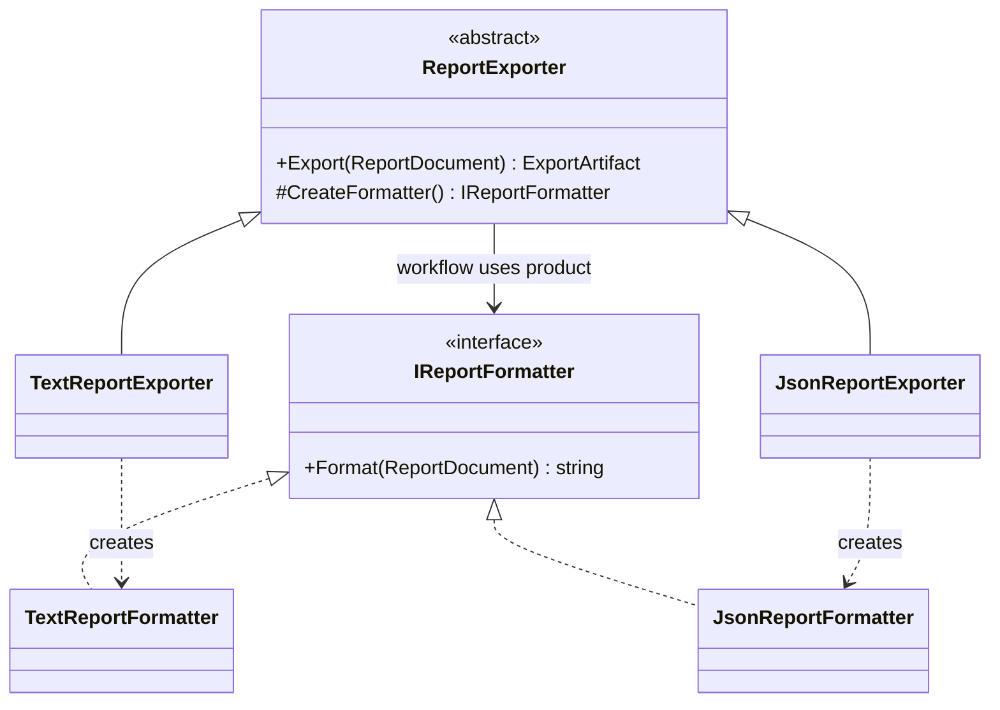
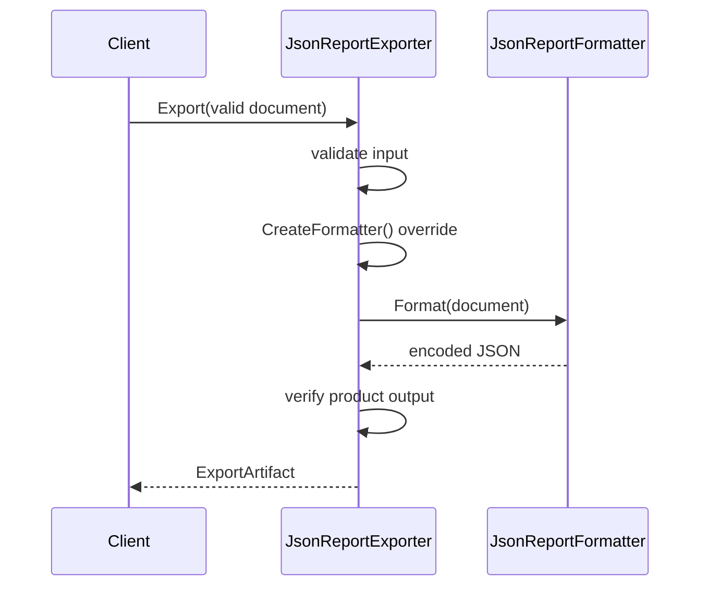

# Factory Method: A Creator Workflow with an Explicit Product Hook

## Learning Outcomes and Original Requirement

A reporting application exports a validated report as plain text or JSON. The shared workflow must
reject invalid input, obtain a formatter, render content, and produce an artifact with a media type.
Format-specific encoding should not be scattered throughout calling code.

Initially, `SwitchReportExporter` selects between two products. That is a reasonable closed list. The
new requirement is an extension point: another creator implementation should choose a different product
without editing the base workflow or switch. Factory Method expresses that inheritance-based choice.

By the end, identify creator/product roles, trace the hook, distinguish static/simple factories from
GoF Factory Method, and decide whether constructor injection would actually be simpler.

## Source Map

Source paths are relative to `10-architecture/design-patterns/src/Learning.Patterns.Creational/`.

| Path | Purpose |
|---|---|
| `FactoryMethod/ReportDocument.cs` | immutable bounded input snapshot |
| `FactoryMethod/ExportArtifact.cs` | shared rendering-output boundary |
| `FactoryMethod/Products/IReportFormatter.cs` | product capability contract |
| `FactoryMethod/Products/TextReportFormatter.cs` | plain-text representation and LF ordering |
| `FactoryMethod/Products/JsonReportFormatter.cs` | JSON encoding through the serializer |
| `FactoryMethod/Baseline/SwitchReportExporter.cs` | correct closed-list creation baseline |
| `FactoryMethod/Refactored/ReportExporter.cs` | creator workflow and protected factory method |
| `FactoryMethod/Refactored/TextReportExporter.cs` | concrete creator selecting a text product |
| `FactoryMethod/Refactored/JsonReportExporter.cs` | concrete creator selecting a JSON product |
| `FactoryMethod/Alternatives/InjectedReportExporter.cs` | composition alternative |
| `FactoryMethod/FactoryMethodDemo.cs` | runnable comparison |

Tests live under `tests/Learning.Patterns.Creational.Tests/FactoryMethod/` in the track directory.

## The Crucial Collaboration



`ReportExporter.Export` is the public workflow. It is nonvirtual: callers do not replace the entire
workflow merely to select a format. `CreateFormatter` is the protected abstract factory method, and
concrete creators override that hook. The returned product is used through `IReportFormatter`.

A method named `Create` is not enough to identify the pattern. The important collaboration is a creator
workflow delegating product creation to an overridable hook. See the
[factory vocabulary comparison](../comparisons/factory-vocabulary.md) for the related alternatives.

## Trace One JSON Export



The creator chooses the product; the product chooses encoding; the artifact boundary checks output.
The caller chooses which creator to construct. That final selection still exists—Factory Method does
not make configuration or runtime dispatch disappear.

This workflow resembles Template Method because it preserves a procedure while exposing a hook. Its
focus here is the product creation hook. Pattern relationships are useful; claiming every base-class
method is a Factory Method is not.

## Input and Output Contracts

The report title is trimmed, nonblank, and at most 100 characters. It has 1..100 nonblank paragraphs,
each at most 1000 characters. Enumeration takes at most 101 entries before rejecting overflow; the
constructor does not fully enumerate an arbitrarily long sequence merely to discover the limit.
It copies accepted input into an immutable array so later caller mutation cannot change output.

These are local lesson budgets. Real upload/document systems additionally need byte budgets, encoding
policies, malicious-content checks, streaming, and deployment-specific limits. A paragraph character
limit is not a complete memory or transport security policy.

Text uses LF and preserves paragraph order. JSON uses `JsonSerializer`, not string concatenation.
Quotes, newlines, and Unicode must round-trip as data. Artifacts require a nonblank media type and
nonblank content. The guard surfaces a broken product instead of returning an empty apparent success.

The artifact is in-memory data. No filename/path is built from the title, and no file/network side
effect is hidden behind `Export`. Persistence, HTTP download headers, and authorization would be
separate application/transport concerns.

## Extension Without Changing the Creator

The test suite defines a new creator whose factory method returns a custom uppercase formatter. The
base workflow remains unchanged and returns the custom product's output. This demonstrates the
extension mechanism rather than merely asserting that `TextReportExporter` exists.

Another test verifies the hook is invoked once for each export. The base does not cache a product.
That is the current lifecycle contract, not a universal Factory Method requirement. The concrete
products are stateless and own no disposable resources, so per-call creation is cheap and unambiguous.

If a future product owns a stream or connection, decide who disposes it and whether the factory creates
or borrows it. Do not silently dispose a container-owned singleton or reuse a failed request-scoped
product. An abstract method alone does not answer ownership.

## Prefer Composition When It Fits Better

`InjectedReportExporter` receives a formatter directly and uses the same artifact boundary. It avoids
creator subclasses and is often the simpler choice in a DI-based application where the caller already
owns product selection. It is deliberately presented as an alternative, not renamed Factory Method.

| Approach | Appropriate pressure | Main cost |
|---|---|---|
| Switch/simple factory | small closed format set | add a case when the set changes |
| Factory Method | existing creator hierarchy needs a product hook | inheritance coupling and more types |
| Constructor injection | caller already selects a capability | composition/wiring ownership |
| Static named factory | meaningful construction names/invariants | does not provide an overridable creator workflow |

Do not create a creator subclass hierarchy solely to replace a constructor parameter. The lesson
implements the canonical mechanism so readers can recognize it and evaluate its costs honestly.

## Failure Behavior and Tests

`ReportExporterTests` includes:

- Baseline/refactored/injected equivalence for text and JSON.
- Explicit expected text representation and JSON round-tripping of difficult data.
- A new consumer-defined creator without changes to the base workflow.
- Per-export creation and invalid-input rejection before product creation.
- Broken factory returning null and broken formatter returning blank content.
- Unknown format rejection instead of a silent default.
- Title/paragraph bounds, input collection copying, and deterministic demo output.

Expected input contract failures are argument exceptions. Missing/invalid factory output is an internal
contract failure. A host must translate only known boundary errors; catching all exceptions as “invalid
document” would hide implementation defects.

## Run and Expected Output

```powershell
dotnet run --project 10-architecture/design-patterns/src/Learning.Patterns.ConsoleApp -- --pattern creational.factory-method
dotnet test 10-architecture/design-patterns/solutions/creational.slnx --configuration Release
```

```text
Text media type: text/plain
Text first line: Architecture report
JSON title: Architecture report
Injected formatter: text/plain
```

The sample has no filesystem dependence and does not require a DI container or external service.

## Exercises

1. Add a CSV formatter and concrete creator. Specify quoting, newline handling, field ordering, and
   spreadsheet-formula risks before calling it safe for arbitrary exports. Do not edit the base creator.
2. Replace creator selection with explicit composition in a calling application. Explain which part
   remains Factory Method and which part is just choosing an implementation.
3. Add a resource-owning product using a test stream. Define creation/borrowing/disposal ownership and
   prove the resource remains correct on a formatter exception.
4. Evaluate whether the original two-format application should keep the simpler injected exporter.
5. Compare this single-product hook with Abstract Factory's related product families once that lesson
   is delivered. Do not call a two-case switch an Abstract Factory merely because it returns an interface.

## Primary References

- [GoF canonical catalog](https://www.informit.com/store/design-patterns-elements-of-reusable-object-oriented-9780321770462).
- [C# abstract and sealed members](https://learn.microsoft.com/en-us/dotnet/csharp/programming-guide/classes-and-structs/abstract-and-sealed-classes-and-class-members).
- [.NET DI ownership guidelines](https://learn.microsoft.com/en-us/dotnet/core/extensions/dependency-injection/guidelines).

## Navigation

- Previous guided topic: [Strategy](../behavioral/strategy.md).
- Comparison: [Factory vocabulary](../comparisons/factory-vocabulary.md).
- Catalog: [Roadmap](../00-roadmap.md).
- Next guided topic: [Adapter](../structural/adapter.md).
