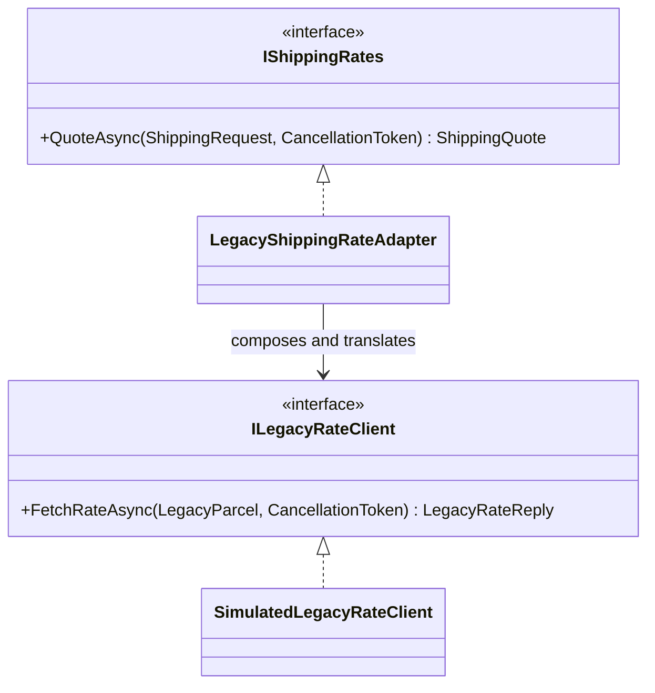
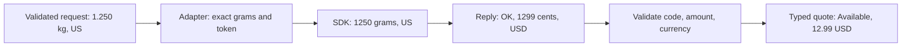

# Adapter: Translating a Legacy Shipping Contract Safely

## Requirement and Learning Outcomes

Checkout needs a shipping quote in USD from a request expressed in kilograms and a two-letter country
code. An existing SDK instead accepts whole grams and returns string status codes, nullable integer
cents, and a currency field. Checkout should not learn those SDK details or duplicate translations in
every consumer.

Adapter supplies the contract checkout needs while composing the incompatible client. The important
work is semantic translation: units, price representation, known availability outcomes, unexpected
protocol data, cancellation, and resource ownership—not merely forwarding to a differently named method.

After the lesson, identify client/target/adapter/adaptee, trace both conversion directions, distinguish
normal outcomes from corrupt replies, and explain what this offline simulation does not test.

## Source Map

Paths are relative to `10-architecture/design-patterns/src/Learning.Patterns.Structural/`.

| File or folder | Responsibility |
|---|---|
| `Adapter/Contracts/ShippingRequest.cs` | validated immutable client input |
| `Adapter/Contracts/ShippingQuote.cs` | typed outcomes and valid USD amount |
| `Adapter/Contracts/IShippingRates.cs` | client-owned target contract |
| `Adapter/Legacy/ILegacyRateClient.cs` | incompatible SDK vocabulary and documented exception |
| `Adapter/Legacy/SimulatedLegacyRateClient.cs` | deterministic offline provider simulation |
| `Adapter/Baseline/LegacyCoupledCheckout.cs` | original application-side integration coupling |
| `Adapter/Refactored/LegacyShippingRateAdapter.cs` | object adapter and translation boundary |
| `Adapter/AdapterDemo.cs` | baseline/refactor and expected failure outcomes |

Read `tests/Learning.Patterns.Structural.Tests/Adapter/ShippingAdapterTests.cs` after the translation
table below. Tests explain the protocol boundaries, not only the happy path.

## Correct Baseline, Awkward Ownership of Knowledge

The baseline accepts the same validated request and correctly handles the simulated SDK. Its problem
is that checkout implementation knows the SDK parcel type, gram conversion, status strings, cents,
currency rule, and transient exception type. Another application consumer would copy that knowledge or
depend on this checkout-specific class.

The refactor moves that knowledge behind `IShippingRates`. The target contract belongs to the client,
not to the SDK vendor. A future provider can implement that contract without teaching checkout a new
vendor vocabulary. The legacy types stay deliberately awkward so the reason for adaptation remains visible.

Baseline and adapter each implement translation for comparison. Tests also assert independent expected
values and failure cases; baseline agreement alone would not catch the same unit-conversion bug twice.

## Object Collaboration



This is an object adapter using composition. It does not inherit implementation from the SDK. The
application can use `IShippingRates` without referencing legacy request/reply types in its operation.
The adapter itself necessarily knows both contracts; moving coupling to a deliberate boundary is the goal.

## Exact Translation Rules

| Target/input or SDK result | Translation | Why it is explicit |
|---|---|---|
| 1.250 kilograms | 1250 integer grams | preserve weight; no integer truncation or hidden rounding |
| country ` us ` | `US` | normalized two-letter ASCII shape |
| `OK`, 1299 cents, `USD` | available 12.99 USD | decimal division, not integer or binary-float arithmetic |
| `OK`, zero cents, `USD` | available 0.00 USD | free shipping is valid, not missing data |
| `NO_ROUTE` | `NoRoute`, no amount | normal business/provider outcome |
| `BUSY` | `TemporarilyUnavailable`, no amount | expected temporary condition |
| documented unavailable exception | `TemporarilyUnavailable` | classify only a known SDK failure |
| missing/negative/oversized price, wrong currency, unknown code | `InvalidDataException` | corrupt/unsupported protocol, not a free or unavailable quote |
| `OperationCanceledException` | propagate | cancellation is not an ordinary provider outage |
| unexpected implementation exception | propagate | do not hide bugs as transient availability |

The country check validates shape, not membership in an authoritative country registry or serviceability.
The provider decides route availability. Likewise, rejecting a non-USD reply is not currency conversion.
Supporting more currencies requires a deliberate target contract and conversion policy.

## Trace a Quote Through the Boundary



Weight supports 0.001..1000 kg in whole grams. Input with finer precision is rejected before calling
the provider. Bounded input and a checked cast protect conversion. The maximum provider amount is
100000000 cents; the target amount is bounded to 1000000 USD with two decimal places. These lab budgets
are stated requirements, not recommendations for every shipping provider.

## Why Unknown Replies Should Fail Loudly

An SDK upgrade may introduce a new status or change a field contract. Mapping every unfamiliar reply
to `NoRoute` hides that integration failure as a plausible customer outcome. Mapping missing cents to
zero could quote free shipping incorrectly. Ignoring currency could charge a numerically similar but
semantically different amount.

The adapter throws a fixed protocol-error message rather than including raw provider data in a log or
public response. The calling host should record safe diagnostic context and expose a stable error
contract. It must not return provider payloads, credentials, or stack traces to clients.

## Cancellation, Async, and Retries

The adapter rejects a pre-canceled operation before calling the SDK, forwards the original token, and
awaits the SDK without blocking a thread. A cancellation exception is not caught by the known-transient
exception handler. Tests trigger cancellation deterministically inside the provider callback, without
sleeping or depending on network timing.

Cancellation is cooperative: a real SDK must honor its token for in-flight work to stop. Passing a token
cannot force a noncooperative provider to abort. The simulated client completes immediately; it models
the async contract, not actual latency or transport cancellation.

The adapter makes one provider call and performs no hidden retry. Even for quote-only reads, retries
need a budget, timeout policy, and awareness of SDK-level retries and rate limits. Booking or payment
would additionally require side-effect/idempotency reasoning. Do not generalize this quote contract into
a safe shipment-booking API by renaming the method.

## Ownership and Lifetime

The caller constructs and owns the legacy client. The adapter borrows it and does not dispose it after
one quote. The ownership test uses a disposable test client and checks it remains usable/undisposed.
Real HTTP SDKs may require managed client lifetimes, connection pooling, configuration refresh, or DI
factory registration. Apply the relevant lifecycle contract rather than inventing disposal inside a wrapper.

The adapter stores no mutable request state between calls. That does not prove its borrowed SDK is
thread-safe. Reuse/scoping depends on the SDK's documented contract.

## Run and Expected Output

```powershell
dotnet run --project 10-architecture/design-patterns/src/Learning.Patterns.ConsoleApp -- --pattern structural.adapter
dotnet test 10-architecture/design-patterns/solutions/structural.slnx --configuration Release
```

```text
Baseline USD: 12.99
Adapter USD: 12.99
GB route: NoRoute
DE provider: TemporarilyUnavailable
```

The simulated routes are invented fixture behavior, not facts about real countries or shipping services.
No vendor credentials, paid calls, sockets, or timing-sensitive dependencies are required.

## Evidence and Limits

Tests cover exact gram conversion at small/normal/max weights, country normalization, cents preservation,
free shipping, protocol errors, known/unknown failures, no hidden retry, cancellation before/during
provider work, invalid requests, borrowed-client ownership, baseline equivalence, and deterministic output.

They do not test an actual SDK's serialization, HTTP behavior, timeout, TLS, authentication, rate-limit
headers, retry defaults, or production service availability. A real integration needs adapter contract
tests against the vendor sandbox and transport-level tests in an appropriate later phase.

## Adapter Versus Similar Patterns

Adapter makes an incompatible contract usable by the client. Decorator preserves a compatible capability
while adding behavior. Proxy controls access to that capability. Facade offers a simplified subsystem
entry point. Bridge separates two intentionally independent variation dimensions from the outset.

All may compose objects. Their intent and contract changes distinguish them. A one-line pure field
mapping might need only a function, not a dedicated adapter class and interface. This scenario justifies
an adapter because conversion, errors, async cancellation, and ownership form one substantial boundary.

## Exercises with Acceptance Criteria

1. Add a second provider returning decimal USD directly. Implement `IShippingRates` without referencing
   the legacy client types; preserve the target contract and cancellation behavior.
2. Add a new documented legacy status. Specify whether it is a business outcome or protocol failure and
   update tests before changing the mapping. Do not add a catch-all success/default.
3. Introduce another currency by redesigning the target quote. Test currency mismatch explicitly; do
   not perform an undocumented exchange-rate conversion inside this adapter.
4. Add a bounded retry wrapper as a separate concern and prove attempts, cancellation, and no retry
   for protocol errors. Explain how this differs from the Adapter's current responsibility.
5. Replace the simulator with a fake HTTP transport in a separate integration exercise. Keep unit
   conversion tests independent of network plumbing.

## Primary References

- [GoF catalog](https://www.informit.com/store/design-patterns-elements-of-reusable-object-oriented-9780321770462).
- [.NET cooperative cancellation](https://learn.microsoft.com/en-us/dotnet/standard/threading/cancellation-in-managed-threads).
- [.NET exception design guidance](https://learn.microsoft.com/en-us/dotnet/standard/design-guidelines/exception-throwing).
- [.NET DI ownership guidelines](https://learn.microsoft.com/en-us/dotnet/core/extensions/dependency-injection/guidelines).

## Navigation

- Previous guided topic: [Factory Method](../creational/factory-method.md).
- Catalog: [Guided roadmap](../00-roadmap.md).
- Next guided topic: Decorator (planned).
