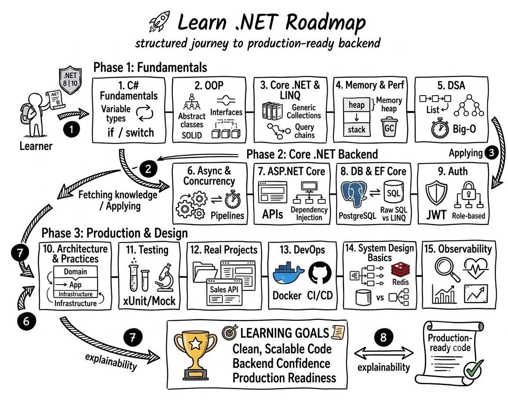

# 🚀 Learn .NET


---

A structured journey from C# fundamentals to production-ready backend development with .NET

---

## 📖 Overview

This repository documents my **learning journey with C# and .NET**, starting from the fundamentals and progressing toward **backend architecture, APIs, and real-world systems**.

The goal of this project is to:

- Build a **strong C# foundation**
- Master **Object-Oriented Programming (OOP)**
- Understand **.NET internals and performance**
- Practice **Data Structures & Algorithms (DSA)**
- Learn **asynchronous and concurrent programming**
- Build **production-ready backend services with ASP.NET Core**

This repository is intended for **learning, practice, and long-term reference**, especially for backend engineers working with .NET.

---

## 🧭 Learning Roadmap

The repository is organized progressively from **fundamentals → advanced → real-world backend development**.


_Figure 1: Structured .NET Learning Journey from Fundamentals to Advanced System Design._

---

### **1. C# Fundamentals**

📁 `01-csharp-basics/`

> Learn the core syntax and behavior of C#

- Overview of .NET ecosystem (CLR, JIT)
- Variables & data types
- `var` vs `dynamic`
- Operators & control flow (`if`, `switch`, loops)
- Methods & parameter modifiers (`ref`, `out`, `in`)
- Arrays & basic collections
- String handling (`string` vs `StringBuilder`)
- Null handling & basic memory concepts

---

### **2. Object-Oriented Programming (OOP)**

📁 `02-oop/`

> Master the core paradigm of C#

- Classes & objects
- Encapsulation
- Inheritance
- Polymorphism
- Abstraction
- Interfaces vs Abstract classes
- Access modifiers
- `Equals()`, `GetHashCode()`, `ToString()`
- SOLID principles (introduction)

### Bonus

- Records vs Classes
- Immutability

---

### **3. Core .NET & Standard Library**

📁 `03-core-dotnet/`

> Understand how .NET works under the hood

- Collections (`List<T>`, `Dictionary<TKey, TValue>`, `HashSet<T>`)
- Generics
- Exception handling
- LINQ (core skill)
- Delegates & Events
- File I/O
- DateTime & TimeZone
- Attributes
- Nullable reference types

---

### **4. Memory & Performance**

📁 `04-memory-performance/`

> Critical for writing efficient and scalable applications

- Stack vs Heap
- Value types vs Reference types
- Garbage Collection (GC)
- Boxing / Unboxing
- `Span<T>`, `Memory<T>`
- Performance optimization techniques

---

### **5. Data Structures & Algorithms (DSA)**

📁 `05-dsa/`

> Build problem-solving and algorithmic thinking

- Big-O notation
- Arrays & Strings
- Linked Lists
- Stacks & Queues
- Hash tables
- Trees & Graphs
- Sorting & Searching
- Recursion & Backtracking

---

### **6. Async & Concurrency**

📁 `06-async-concurrency/`

> Essential for modern backend systems

- `async/await`
- `Task` and `Task<T>`
- Threading basics
- ThreadPool
- Parallel programming
- Synchronization (`lock`, `SemaphoreSlim`)
- Deadlocks (common scenarios)
- `ConfigureAwait(false)`
- I/O-bound vs CPU-bound
- `CancellationToken` (best practices)
- Channels / Pipelines (advanced)
- Concurrent collections

---

### **7. ASP.NET Core**

📁 `07-aspnet-core/`

> Build modern web APIs with ASP.NET Core

- Web API fundamentals
- Controllers & routing
- Dependency Injection
- Middleware pipeline
- Configuration & Logging
- Model binding & validation

---

### **8. Database & ORM (EF Core)**

📁 `08-ef-core/`

> Work with databases using Entity Framework Core

- DbContext & DbSet
- Migrations
- Relationships
- Query optimization
- Transactions
- Tracking vs No-Tracking
- N+1 Query problem
- Compiled queries
- Indexing strategies
- Raw SQL vs LINQ
- Bulk operations
- Performance profiling (EF logs)

---

### **9. Authentication & Authorization**

📁 `09-auth/`

> Secure backend systems

- JWT Authentication
- Role-based authorization
- Policy-based authorization
- Refresh Token flow
- Token rotation
- OAuth2 & OpenID Connect (concept)
- API rate limiting
- OWASP Top 10 basics
- Secure password storage (hashing + salt)

---

### **10. Architecture & Best Practices**

📁 `10-architecture/`

> Write production-level code

- Clean Architecture
- Layered architecture
- Repository pattern
- Service pattern
- DTOs & mapping
- Validation strategies
- Monolith vs Microservices
- Modular monolith (recommended)
- CQRS (basic)
- Domain-driven design (intro)
- API versioning
- Feature-based structure

---

### **11. Testing**

📁 `11-testing/`

> Ensure code quality and reliability

- Unit testing
- Integration testing
- xUnit / NUnit
- Mocking
- Testcontainers (real DB testing)
- API testing automation
- Test data management
- Code coverage basics
- Integration test best practices

---

### **12. Real Projects**

📁 `12-projects/`

> Apply everything into real-world applications

### Suggested Projects

- Sales Management API
- Authentication Service (RBAC)
- File Storage Service
- Mini E-commerce API

---

### **13. DevOps & Deployment**

📁 `13-devops/`

> Learn how to package, deploy, and run applications in real environments

- Docker (Dockerfile, multi-stage build)
- Docker Compose
- Environment configs (dev/staging/prod)
- CI/CD (GitHub Actions)
- Secret management
- Logging setup (Serilog)
- Deploy to cloud (basic: VPS / Azure / AWS)

---

### **14. System Design Basics**

📁 `14-system-design/`

> Develop the ability to design scalable and maintainable backend systems

- Monolith vs Microservices (trade-offs)
- Caching (Redis)
- Message Queue (RabbitMQ / Kafka – basic)
- Rate limiting strategies
- API Gateway concept
- Scalability:
    - Horizontal vs Vertical
    - Load balancing

- Database scaling basics

---

### **15. Observability**

📁 `15-observability/`

> Understand how to monitor, debug, and maintain systems in production

- Structured logging
- Correlation ID
- Distributed tracing (concept)
- Metrics (Prometheus basics)
- Monitoring (Grafana basics)
- Alerting basics

---

## 🏗️ Project Structure

```text
learn-dotnet/
│
├── 01-csharp-basics/
├── 02-oop/
├── 03-core-dotnet/
├── 04-memory-performance/
├── 05-dsa/
├── 06-async-concurrency/
├── 07-aspnet-core/
├── 08-ef-core/
├── 09-auth/
├── 10-architecture/
├── 11-testing/
├── 12-projects/
├── 13-devops/
├── 14-system-design/
├── 15-observability/
│
├── shared/
│   ├── utilities/
│   ├── extensions/
│   └── helpers/
│
├── docs/
│   ├── notes/
│   ├── diagrams/
│   └── cheatsheets/
│
├── README.md
└── .gitignore
```

---

## 📌 Learning Strategy

This repository is not just for reading — it is designed to be **actively used**.

Each module should include:

```text
module/
├── README.md     # Theory & notes
├── examples/     # Code examples
├── exercises/    # Practice problems
```

---

## 🎯 Learning Goals

- Write **clean, maintainable, and scalable C# code**
- Understand **how .NET works internally**
- Be confident in building **backend APIs**
- Apply **best practices and architecture patterns**
- Prepare for **technical interviews and real-world projects**

---

## 🛠️ Tools & Technologies

- **C# / .NET (latest LTS)**
- **ASP.NET Core**
- **Entity Framework Core**
- **SQL Server / PostgreSQL**
- **xUnit / NUnit**
- **Git & GitHub**
- IDE: Visual Studio / VS Code / Rider

---

## 🚀 Best Practices

- Focus on **understanding concepts**, not just syntax
- Write code with **real-world scenarios**
- Refactor regularly
- Keep notes in `/docs`
- Apply what you learn to **actual projects**

---

## 📚 References & Resources

- Official .NET Documentation
  [https://learn.microsoft.com/en-us/dotnet/](https://learn.microsoft.com/en-us/dotnet/)

- ASP.NET Core Docs
  [https://learn.microsoft.com/en-us/aspnet/core/](https://learn.microsoft.com/en-us/aspnet/core/)

- Entity Framework Core Docs
  [https://learn.microsoft.com/en-us/ef/core/](https://learn.microsoft.com/en-us/ef/core/)

- C# Programming Guide
  [https://learn.microsoft.com/en-us/dotnet/csharp/](https://learn.microsoft.com/en-us/dotnet/csharp/)

---

## 📝 Notes

- This repository is **continuously updated**
- Code examples prioritize **clarity over complexity**
- Mistakes and refactoring are part of the learning process

---

## 📄 License

This project is for **learning and educational purposes**.

Feel free to explore, fork, and adapt it for your own journey.
